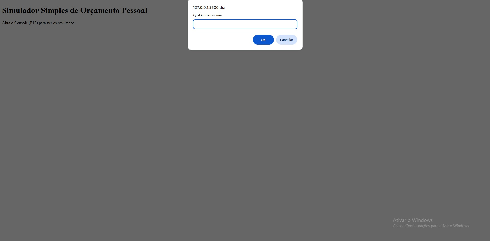
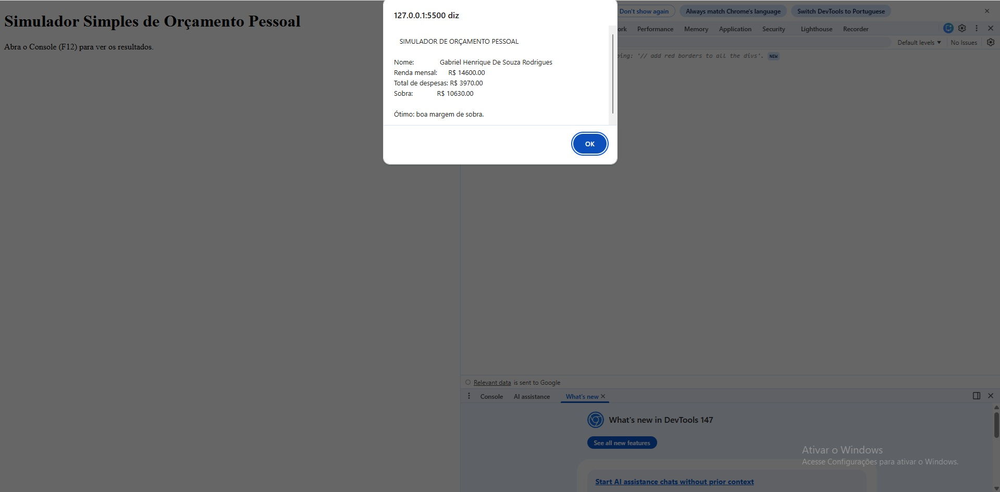
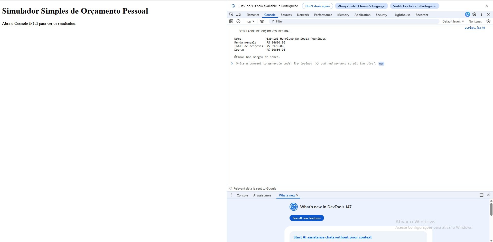

# Trabalho Prático - Semana 7
Nessa atividade, vamos dar os primeiros passos com JavaScript, praticando com a criação de variáveis, emprego de tipos básicos (string, number, boolean), operadores, além de fluxos de controle condicionais e estruturas de repetição (for e while).

## Informações Gerais
- Nome: Gabriel Henrique de Souza Rodrigues
- Matricula: 913558

## Print do console do navegador

